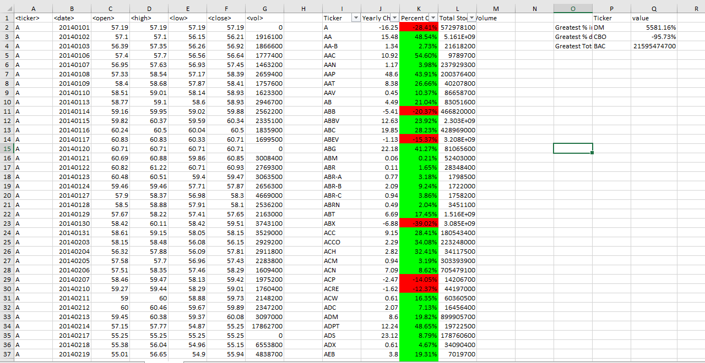
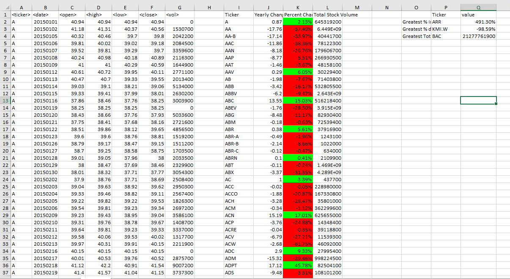
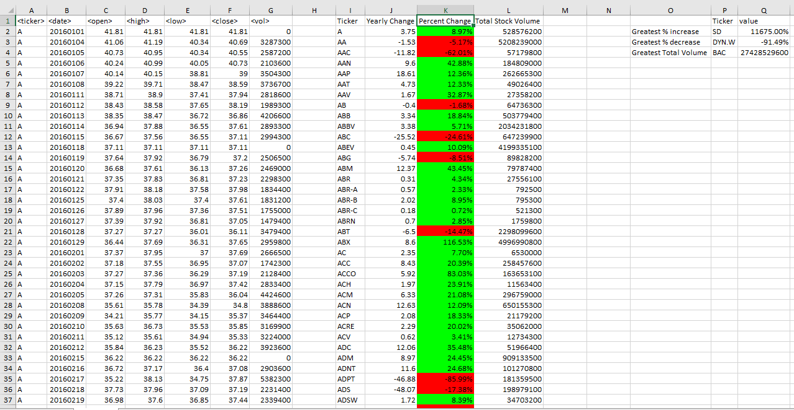

# The VBA of Wall Street

## Introduction

Utilize VBA scripting to analyze real stock market data for 3 consecutive years (2014 - 2016).

## Technologies

This project is created with VBA. The following requirements were met: 

* Create a script that will loop through each year of stock data and grab the total amount of volume each stock had over the year.
* Display the ticker symbol to coincide with the total volume.
* Create a script that will loop through all the stocks and take the following info.
  * Yearly change from what the stock opened the year at to what the closing price was.
  * The percent change from the what it opened the year at to what it closed.
  * The total Volume of the stock
  * Ticker symbol
  * Include conditional formatting that will highlight positive change in green and negative change in red.
*  Adjust the script to allow it to locate the stock with the "Greatest % increase", "Greatest % Decrease" and "Greatest total volume".
*  Adjust the script that will allow it to run on every worksheet just by running it once.

## Illustrations

**2014 Stock Market Analysis Screenshot:**

**2015 Stock Market Analysis Screenshot:** 

**2016 Stock Market Analysis Screenshot:**

